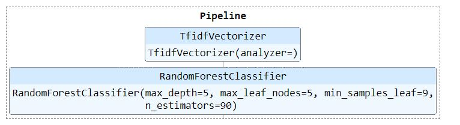
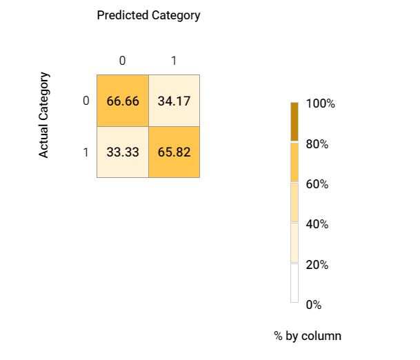
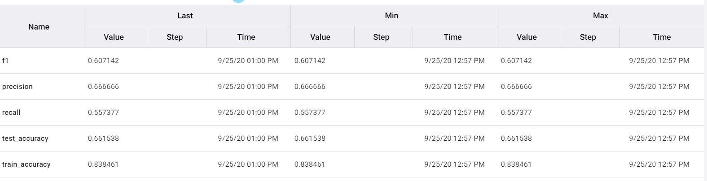
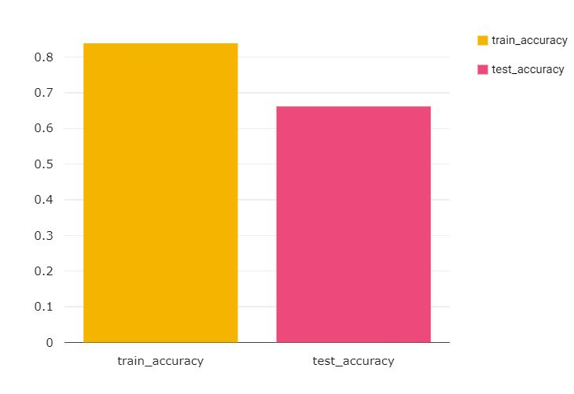

# NLP-BERT-sklearn-Pipeline
Demonstration of NLP model life cycle

## System Information: 

```
Python Version v3.6.9
os Version Linux-4.19.112+-x86_64-with-Ubuntu-18.04-bionic
processor x86_64
```

## Installed Packages

```
scikit-learn==0.22.2
comet-ml==3.2.2
pandas==1.0.5
nltk==3.2.5
bert-sklearn==0.3.1
```
The entire lifecycle of building an end to end pipeline:
1. import data
2. data-preprocessing
3. building pipeline
4. hyper parameter tuning
5. model validation
6. experiment logging

## Hyper Parameters:

```
param = [
                {"classifier": [LogisticRegression()],
                 "classifier__penalty": ['l2','l1'],
                 "classifier__C": np.logspace(0, 4, 10), 
                 "vectorizer" : [TfidfVectorizer(analyzer=transform_text), CountVectorizer(analyzer=transform_text)], 
                 "vectorizer__ngram_range" : [(1,1), (2,2), (3,3)]
                 },

                {"classifier": [LogisticRegression()],
                 "classifier__penalty": ['l2'],
                 "classifier__C": np.logspace(0, 4, 10),
                 "classifier__solver":['newton-cg','saga','sag','liblinear'], ##This solvers don't allow L1 penalty
                 "vectorizer" : [TfidfVectorizer(analyzer=transform_text), CountVectorizer(analyzer=transform_text)], 
                 "vectorizer__ngram_range" : [(1,1), (2,2), (3,3)]
                 },
         
                {"classifier": [RandomForestClassifier()],
                 "classifier__n_estimators": [None, 10, 50, 90, 130],
                 "classifier__max_depth":[None, 5, 7, 9 , 11],
                 "classifier__min_samples_leaf":[None, 1,5,9],
                 "classifier__max_leaf_nodes": [None, 2, 5,10], 
                 "vectorizer" : [TfidfVectorizer(analyzer=transform_text), CountVectorizer(analyzer=transform_text)], 
                  "vectorizer__ngram_range" : [(1,1), (2,2), (3,3)]
                }, 
                {
                  "classifier": [BertClassifier(train_batch_size = 4)],
                  "vectorizer": ['passthrough']
                }
         ]

```

## Final Pipeline


## Model Results

#### confusion matrix


#### Metrics


#### visuals

